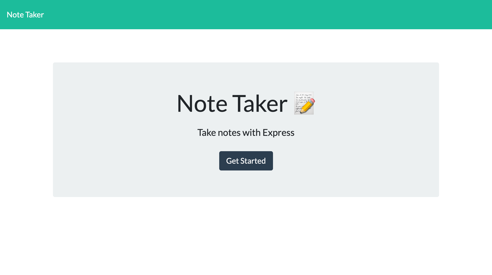
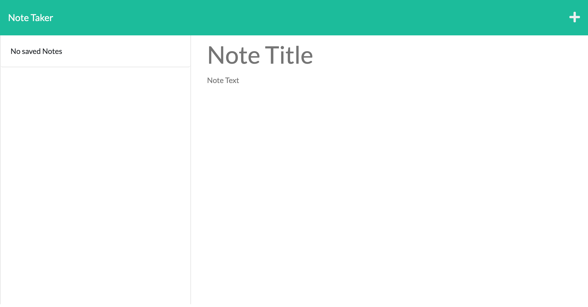

# Note Taker 

## Description

Generate notes to simplify and oragnize daily tasks. This note taker app has the capability to save and delete existing notes.

## Usage
To run the app on your local machine:

1. npm i 
2. npm start

## HerokuLink (Deployed App)
[Click here](https://summer-note-taker.herokuapp.com/)

## Screenshots

.png)

# About me
* Find me on GitHub: https://github.com/Summerjay0401
* E-mail: summerjadefrosal@gmail.com

# by Summer Jade Rosal